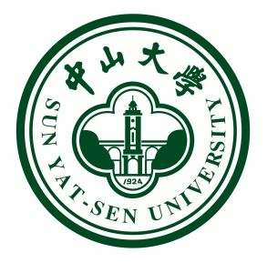



  <!-- 第二组图片和段落 -->
  

    <!-- 图片部分（1/3） -->
    

      
    

    <!-- 文字部分（2/3） -->
    

      
<strong>Sun Yat-sen University</strong> 
      2023.6 - 2026.12 
     School of Computer Science and Engineering, Guangdong Key Laboratory of Big Data Analysis and Processing 
      Visiting Student 
      Supervised by Assoc. Prof. <a href="https://scholar.google.com.hk/citations?user=qg7gv20AAAAJ&hl=zh-CN&oi=ao">Yanghui Rao</a>  
      

    

  

  <!-- 第三组图片和段落 -->
  

    <!-- 图片部分（1/3） -->
    

      
    

    <!-- 文字部分（2/3） -->
    

      
<strong>Shandong University</strong> 
      2019.9 - 2023.6 
      Software College  
      B.E. degree in Software Engineering (New Engineering Experimental Class (Special class)) 
          Supervised by Prof. <a href="https://scholar.google.com.hk/citations?user=WIHqungAAAAJ&hl=zh-CN&oi=ao/">Yongshun Gong</a>  
      <!-- GPA: 91.56/100 Rank: 27/300  -->
    

    

  

  <!-- 第四组图片和段落 -->
  

    <!-- 图片部分（1/3） -->
    

      
    

    <!-- 文字部分（2/3） -->
    

      
<strong>Shengli No.1 Middle School of Dongying</strong> 
      2016.9 - 2019.6 
    

    

  

# Honors and Awards
* Second-class Academic Scholarship | School of Computer Science, Sun Yat-sen University | 2023 |
* Outstanding Graduate | Software College, Shandong University | 2023 |
* "Power of Role Models" Star of the Branch Award | Software College, Shandong University | 2022 |
* Shandong University Five-a-Side Football Championship | Software College, Shandong University| 2022 |
* Second-class Academic Scholarship | Software College, Shandong University | 2020, 2021 |
* Second-class Cultural and Sports Scholarship | Software College, Shandong University | 2020 |
 
