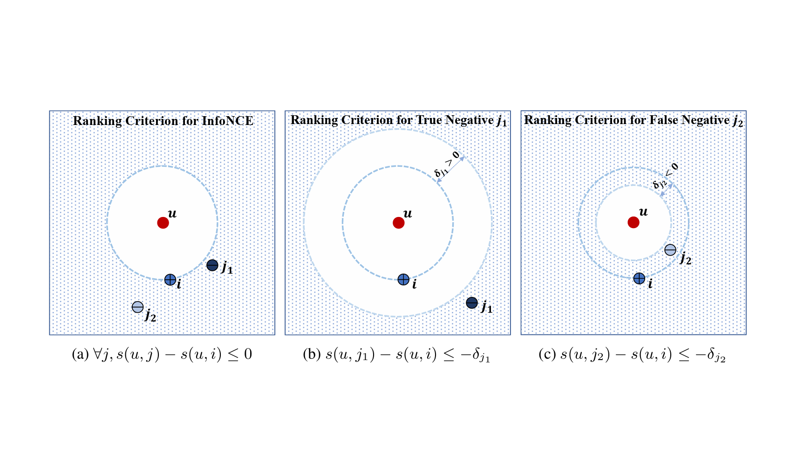
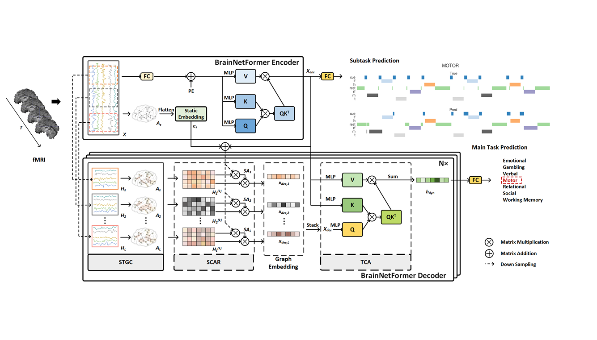

* denotes co-first author and &#8224; denotes corresponding author

**On Generative Agents in Recommendation**  
An Zhang\*, **Leheng Sheng\***, Yuxin Chen\*, Hao Li, Yang Deng, Xiang Wang&#8224;, Tat-Seng Chua

**Arxiv, 2023.10** [[Paper](https://arxiv.org/pdf/2310.10108.pdf)] [[Arxiv](https://arxiv.org/abs/2310.10108)] [[Code](https://github.com/LehengTHU/Agent4Rec)]  

**Empowering Collaborative Filtering with Principled Adversarial Contrastive Loss**  
An Zhang\*, **Leheng Sheng\***, Zhibo Cai&#8224;, Xiang Wang, Tat-Seng Chua  

**NeurIPS, 2023** [[Paper](https://neurips.cc/virtual/2023/poster/71149)] [[Code](https://github.com/LehengTHU/AdvInfoNCE)]  

**BrainNetFormer: Decoding Brain Cognitive States with Spatial-Temporal Cross Attention**  
**Leheng Sheng**, Wehan Wang, Zhiyi Shi, Jichao Zhan, Youyong Kong&#8224;  

**ICASSP, 2023** [[Paper](https://ieeexplore.ieee.org/abstract/document/10094655)] 


  You can also find my articles on <u><a href="{{author.googlescholar}}">my Google Scholar profile</a>.</u>





  

