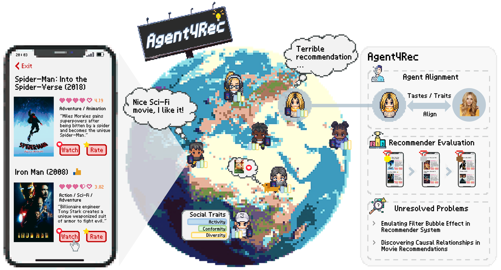

\* denotes co-first author and &#8224; denotes corresponding author

  <!-- 第一组图片和段落 -->
  

    <!-- 图片部分（1/3） -->
    

      
    

    <!-- 文字部分（2/3） -->
    

      
<strong>On Generative Agents in Recommendation</strong> 
      An Zhang*, <strong>Leheng Sheng*</strong>, Yuxin Chen*, Hao Li, Yang Deng, Xiang Wang†, Tat-Seng Chua 
      <strong>Arxiv, 2023.10</strong> 
    <a href="https://arxiv.org/pdf/2310.10108.pdf">[Paper]</a> <a href="https://arxiv.org/abs/2310.10108">[Arxiv]</a> <a href="https://github.com/LehengTHU/Agent4Rec">[Code]</a>
      

    

  

  <!-- 第二组图片和段落 -->
  

    <!-- 图片部分（1/3） -->
    

      
    

    <!-- 文字部分（2/3） -->
    

      
<strong>Empowering Collaborative Filtering with Principled Adversarial Contrastive Loss</strong> 
      An Zhang*, <strong>Leheng Sheng*</strong>, Zhibo Cai†, Xiang Wang, Tat-Seng Chua 
    <strong>NeurIPS, 2023 (CCF A)</strong> 
    <a href="https://neurips.cc/virtual/2023/poster/71149">[Paper]</a> <a href="https://arxiv.org/abs/2310.18700">[Arxiv]</a> <a href="https://github.com/LehengTHU/AdvInfoNCE">[Code]</a>
      

    

  

  <!-- 第三组图片和段落 -->
  

    <!-- 图片部分（1/3） -->
    

      
    

    <!-- 文字部分（2/3） -->
    

      
<strong>BrainNetFormer: Decoding Brain Cognitive States with Spatial-Temporal Cross Attention</strong> 
      <strong>Leheng Sheng</strong>, Wehan Wang, Zhiyi Shi, Jichao Zhan, Youyong Kong† 
    <strong>ICASSP, 2023 (CCF B)</strong> 
    <a href="https://ieeexplore.ieee.org/abstract/document/10094655">[Paper]</a>
    

    

  

<!-- 

  

    
    
    
  

  

    
<strong>On Generative Agents in Recommendation</strong> 
    An Zhang*, <strong>Leheng Sheng*</strong>, Yuxin Chen*, Hao Li, Yang Deng, Xiang Wang†, Tat-Seng Chua 
    <strong>Arxiv, 2023.10</strong> 
    <a href="https://arxiv.org/pdf/2310.10108.pdf">[Paper]</a> <a href="https://arxiv.org/abs/2310.10108">[Arxiv]</a> <a href="https://github.com/LehengTHU/Agent4Rec">[Code]</a>

    
<strong>Empowering Collaborative Filtering with Principled Adversarial Contrastive Loss</strong> 
    An Zhang*, <strong>Leheng Sheng*</strong>, Zhibo Cai†, Xiang Wang, Tat-Seng Chua 
    <strong>NeurIPS, 2023 (CCF A)</strong> 
    <a href="https://neurips.cc/virtual/2023/poster/71149">[Paper]</a> <a href="https://github.com/LehengTHU/AdvInfoNCE">[Code]</a>

    
<strong>BrainNetFormer: Decoding Brain Cognitive States with Spatial-Temporal Cross Attention</strong> 
    <strong>Leheng Sheng</strong>, Wehan Wang, Zhiyi Shi, Jichao Zhan, Youyong Kong† 
    <strong>ICASSP, 2023 (CCF B)</strong> 
    <a href="https://ieeexplore.ieee.org/abstract/document/10094655">[Paper]</a>

  

 -->


  You can also find my articles on <u><a href="{{author.googlescholar}}">my Google Scholar profile</a>.</u>





  

